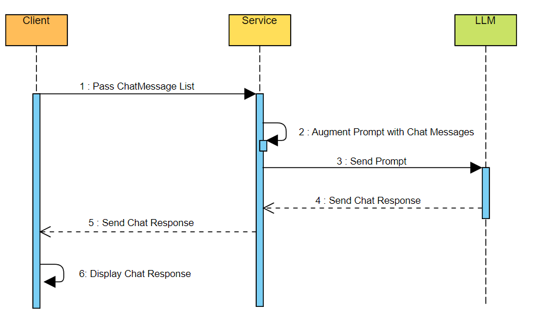

### Demo code for LLM based chat application
This is a source code to consume Anthropic Claude Base Model from Amazon Bedrock to build a chat application.

Full sequence diagram of the chat application is shown below: 


This repo contains the Javascript code for the backend service to be deployed in AWS Lambda which can be exposed to UI through API gateway.

The code formats the chat messages received by front end in the format expected by LLM service. Below is the code snippet to format the message list into a String with a series of Human and Assistant texts as required by Anthropic Claude LLM. 

```
const formatMessages = (chatHistory: ChatMessage[]) => {
  const formattedDialogueTurns = chatHistory.map((message) => {
    if (message.role === "user") {
      return `Human: ${message.content}`;
    } else if (message.role === "assistant") {
      return `Assistant: ${message.content}`;
    } else {
      return `${message.role}: ${message.content}`;
    }
  });
  return formattedDialogueTurns.join("\n");
};

```

Once the input text is in the correct format, we are all set to send the request to Claude foundation model in Bedrock using AWS Javascript SDK: 

```
const bedrock = new BedrockRuntimeClient({
      serviceId: 'bedrock',
      region: 'us-east-1',
      });

      const result = await bedrock.send(
      new InvokeModelCommand({
      modelId: 'anthropic.claude-v2',
      contentType: 'application/json',
      accept: '*/*',
      body: JSON.stringify({
        prompt,
        max_tokens_to_sample: 2000,
        // Temperature (1-0) is how 'creative' the LLM should be in its response
        // 1: deterministic, prone to repeating
        // 0: creative, prone to hallucinations
        temperature: 1,
        top_k: 250,
        top_p: 0.99,
        // This tells the model when to stop its response. LLMs
        // generally have a chat-like string of Human and Assistant message
        // This says stop when the Assistant (Claude) is done and expects
        // the human to respond
        stop_sequences: ['\n\nHuman:'],
        anthropic_version: 'bedrock-2023-05-31'
      })
    })
  );
  // The response is a Uint8Array of a stringified JSON blob
  // so you need to first decode the Uint8Array to a string
  // then parse the string.
  return new TextDecoder().decode(result.body);
  ```


After we configure API gateway the code is all set to be consumed by UI application.


Fron end UI code is available here:  [https://github.com/sekharkafle/chatui](https://github.com/sekharkafle/chatui)

For complete details on the application, please check here: [http://kafles.com/2024/04/13/practical-llm1/](http://kafles.com/2024/04/13/practical-llm1/)

Happy Chatting!!!
